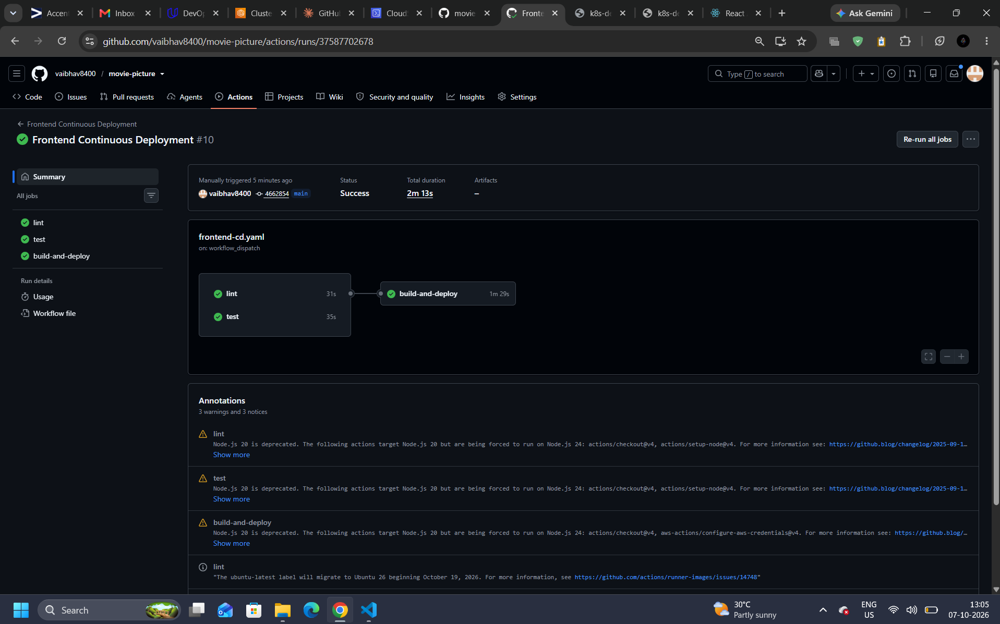
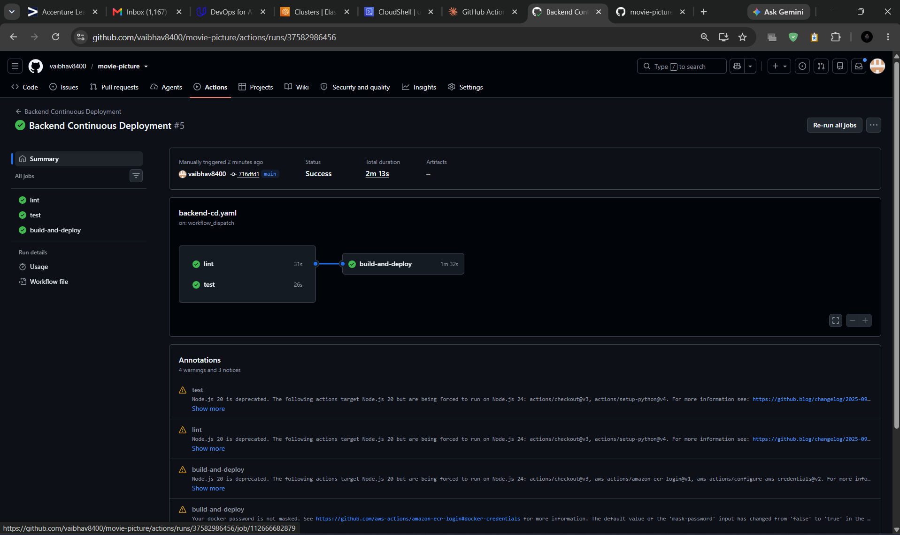
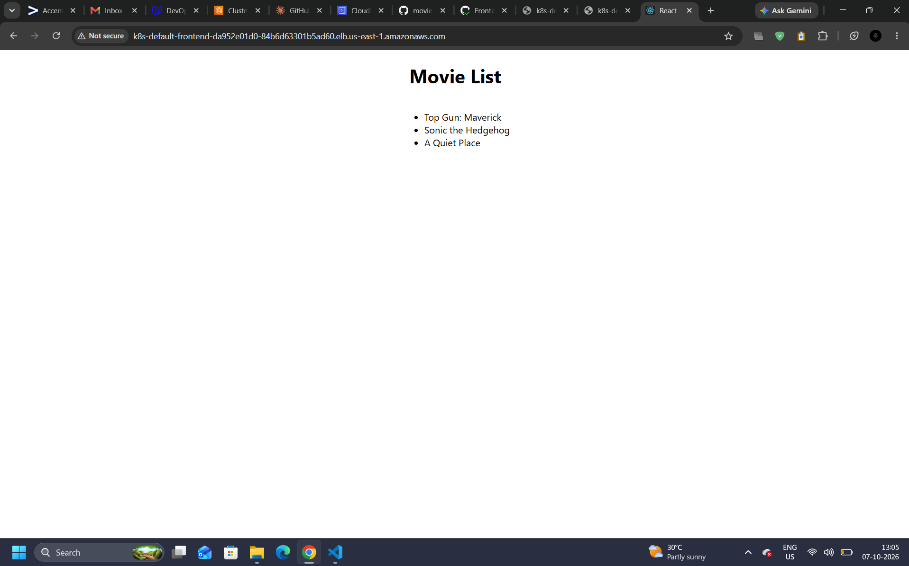
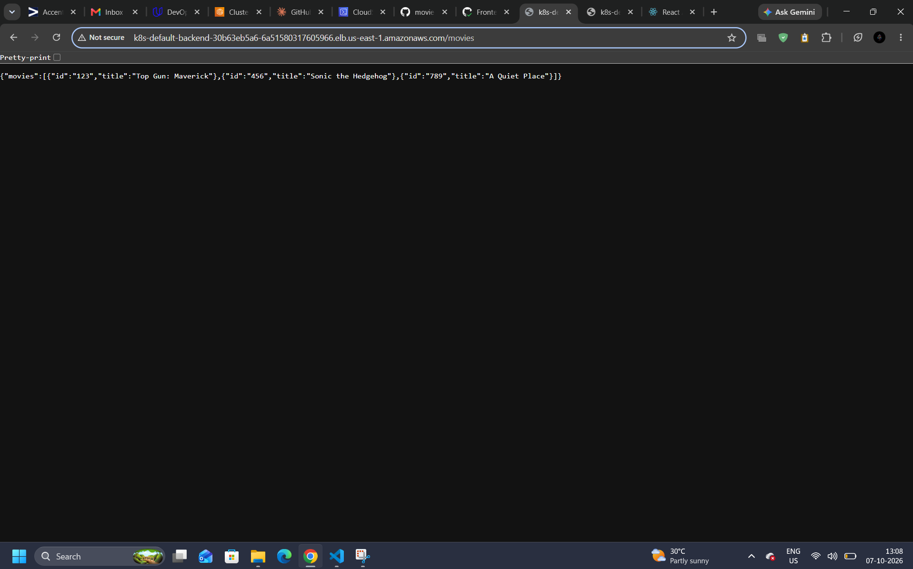
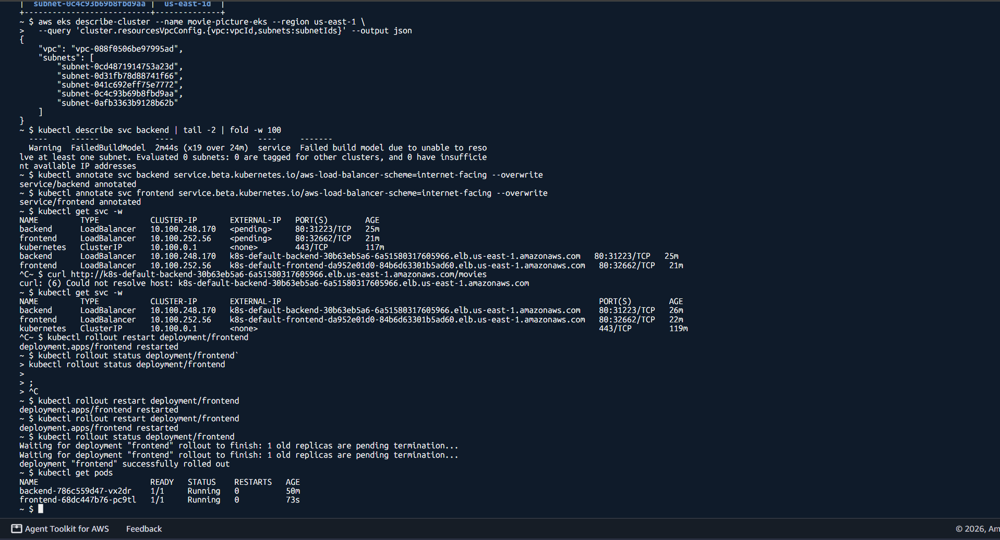
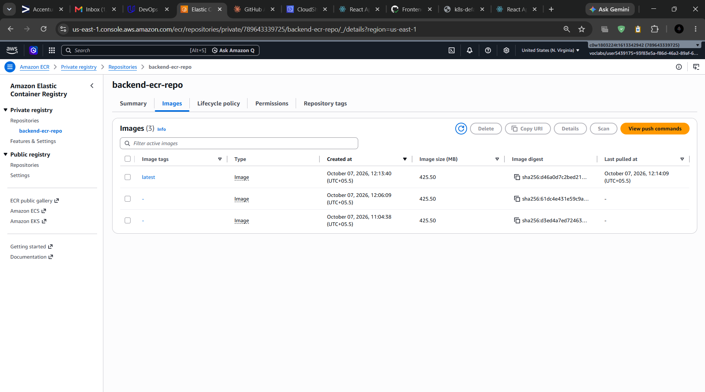
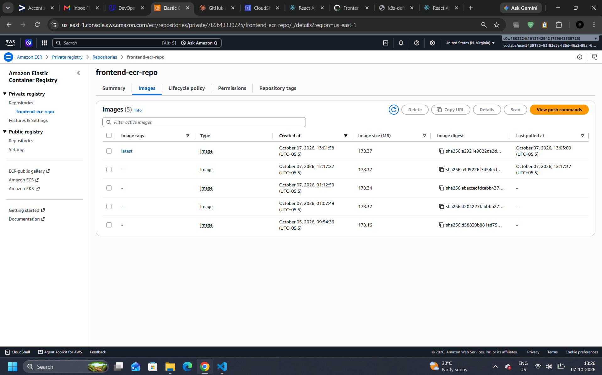

# Movie Picture Pipeline

An automated continuous integration and continuous deployment (CI/CD) pipeline built with GitHub Actions, Docker, Amazon ECR, and Kubernetes (AWS EKS) for a microservices-based Movie Picture web application.

---

## 🌐 Live Microservice Endpoints

The microservices are continuously deployed to an AWS EKS cluster via AWS Elastic Load Balancers:

* **Frontend Web Application:** http://k8s-default-frontend-da952e01d0-84b6d63301b5ad60.elb.us-east-1.amazonaws.com
* **Backend REST API (`/movies`):** http://k8s-default-backend-30b63eb5a6-6a51580317605966.elb.us-east-1.amazonaws.com/movies
* **Source Repository:** https://github.com/vaibhav8400/movie-picture

---

## 📸 Evidence

### Workflow Runs

| Workflow | Screenshot |
| :--- | :--- |
| Frontend CD |  |
| Backend CD |  |

> Frontend CI and Backend CI screenshots will be added after the pull request runs (`screenshots/frontend-ci.png`, `screenshots/backend-ci.png`).

### Deployed Applications

* **Frontend loading movies from the backend:**

  

* **Backend `/movies` response:**

  

### Kubernetes Cluster State



### Amazon ECR Images

**Backend repository (`backend-ecr-repo`):**



**Frontend repository (`frontend-ecr-repo`):**



---

## 🏗️ Architecture & Tech Stack

* **Frontend Application (`starter/frontend`):** React 18 and TypeScript Single Page Application served via a production Node/Express runtime.
* **Backend REST API (`starter/backend`):** Python 3.10 Flask service served using uWSGI with enabled Cross-Origin Resource Sharing (CORS).
* **Container Registry:** Amazon Elastic Container Registry (ECR) for backend and frontend Docker images.
* **Cluster Orchestration:** Amazon Elastic Kubernetes Service (AWS EKS, cluster `movie-picture-eks`, Kubernetes 1.36) provisioned with Terraform, with Kustomize used to set image tags at deploy time.
* **Networking:** Both services are exposed through internet-facing AWS load balancers (annotation `service.beta.kubernetes.io/aws-load-balancer-scheme: internet-facing`), with the default VPC subnets tagged for load balancer discovery.
* **CI/CD Automation:** GitHub Actions workflows executing dependency caching, linting, testing, image building, and rolling releases.

---

## 🚀 CI/CD Pipeline Implementation

### 1. Frontend Continuous Integration (`frontend-ci.yaml`)

Workflow name: **Frontend Continuous Integration**. Triggered on pull requests targeting `main` and via `workflow_dispatch`:

* **Lint Job:**
  * Checkout code and Node.js setup.
  * **Cache:** Restores npm dependencies prior to installation.
  * Dependency installation via `npm ci`, followed by ESLint verification (`npm run lint`).
* **Test Job (runs in parallel with Lint):**
  * Checkout code and Node.js setup.
  * **Cache:** Restores npm dependencies prior to installation.
  * Dependency installation via `npm ci`, then Jest tests in non-interactive mode (`npm test -- --watchAll=false`).
* **Build Job (requires `[lint, test]` via `needs`):**
  * Checkout code, Node.js setup, cache restore, and dependency installation.
  * Application image built with Docker (`docker build`).

### 2. Backend Continuous Integration (`backend-ci.yaml`)

Workflow name: **Backend Continuous Integration**. Triggered on pull requests targeting `main` and via `workflow_dispatch`:

* **Lint Job:** Runs `flake8` under Pipenv.
* **Test Job (runs in parallel with Lint):** Runs `pytest` under Pipenv.
* **Build Job (requires `[lint, test]` via `needs`):** Builds the backend Docker image.

### 3. Backend Continuous Deployment (`backend-cd.yaml`)

Workflow name: **Backend Continuous Deployment**. Triggered on push to `main` modifying `starter/backend/**` and via `workflow_dispatch`:

* **Lint and Test jobs** run in parallel (`flake8` and `pytest` under Pipenv).
* **Build-and-deploy job** (requires `[lint, test]`):
  * Authenticates with AWS using GitHub Secrets and logs in to ECR via `aws-actions/amazon-ecr-login`.
  * Builds, tags, and pushes the backend Docker image to Amazon ECR.
  * Updates the Kubernetes deployment image with `kustomize edit set image` and applies the manifests.
  * **Deployment verification & logging:**
    * `kubectl rollout status deployment/backend --timeout=180s`
    * `kubectl get all`
    * `kubectl describe deploy backend`
    * `aws ecr describe-images --repository-name backend-ecr-repo --image-ids imageTag=latest`

### 4. Frontend Continuous Deployment (`frontend-cd.yaml`)

Workflow name: **Frontend Continuous Deployment**. Triggered on push to `main` modifying `starter/frontend/**` and via `workflow_dispatch`:

* **Lint and Test jobs** run in parallel (ESLint and Jest, with npm caching).
* **Build-and-deploy job** (requires `[lint, test]`):
  * Authenticates with AWS using GitHub Secrets and logs in to ECR via `aws-actions/amazon-ecr-login`.
  * Builds the production Docker image with the backend URL injected as a build argument (`--build-arg REACT_APP_MOVIE_API_URL`, read from a GitHub Secret).
  * Pushes the frontend image to Amazon ECR and deploys to EKS using Kustomize.
  * **Deployment verification & logging:**
    * `kubectl rollout status deployment/frontend --timeout=180s`
    * `kubectl get all`
    * `kubectl describe deploy frontend`
    * `aws ecr describe-images --repository-name frontend-ecr-repo --image-ids imageTag=latest`

---

## 🔐 GitHub Repository Secrets Configuration

No credentials are stored in the repository or workflow files. The following repository secrets are configured under **Settings > Secrets and variables > Actions**:

| Secret Name | Value / Description |
| :--- | :--- |
| `AWS_ACCESS_KEY_ID` | AWS IAM Access Key ID |
| `AWS_SECRET_ACCESS_KEY` | AWS IAM Secret Access Key |
| `AWS_SESSION_TOKEN` | AWS STS Session Token (for Learner Lab sessions) |
| `AWS_DEFAULT_REGION` | `us-east-1` |
| `EKS_CLUSTER_NAME` | `movie-picture-eks` |
| `BACKEND_ECR_REPO` | `backend-ecr-repo` |
| `FRONTEND_ECR_REPO` | `frontend-ecr-repo` |
| `REACT_APP_MOVIE_API_URL` | Backend load balancer URL (e.g. `http://<backend-elb-hostname>`, no `/movies` suffix, no trailing slash) |

---

## 💻 Local Development & Testing

### Frontend

```bash
cd starter/frontend

# Install dependencies
npm ci

# Run linter & test suite
npm run lint
npm test -- --watchAll=false

# Build production bundle
npm run build

# Start local server
REACT_APP_MOVIE_API_URL=http://localhost:5000 npm start
```

### Backend

```bash
cd starter/backend

# Install dependencies
pipenv install

# Run application
pipenv run serve

# Check the running application
curl http://localhost:5000/movies
```

### Backend with Docker

```bash
cd starter/backend

# Build and run the image
docker build --tag mp-backend:latest .
docker run -p 5000:5000 --name mp-backend -d mp-backend

# Expected output from /movies
# {"movies":[{"id":"123","title":"Top Gun: Maverick"},{"id":"456","title":"Sonic the Hedgehog"},{"id":"789","title":"A Quiet Place"}]}

# Stop the application
docker stop mp-backend
```
